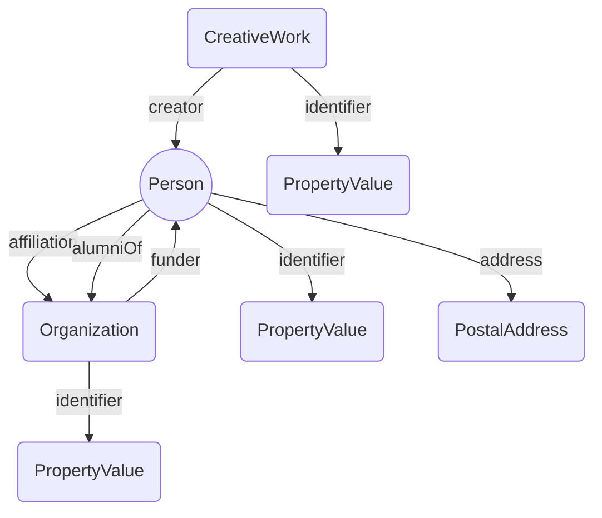

# Ten years building a global taxonomic library: connecting persistent identifiers for names, publications and people

https://blog.pensoft.net/2023/03/06/bicikl-project-supports-article-collection-in-biodiversity-data-journal-about-use-of-linked-data/

## Introduction

One thing the field of biodiversity informatics has been very good at is creating databases. However, this success in creation has not been matched by equivalent success in creating deep links between those databases [Thomas, 2009). Instead we create an ever growing number of silos. An obvious route to “silo-breaking” is the shared use of the same persistent identifiers for the same entities across those databases. For example, rather than mint its own identifier for a publication, a database could reuse the existing Digital Object Identifier (DOI) for that publication. This seemingly trivial step of reusing someone else’s identifier opens up numerous possibilities for interconnection, but comes with some risk: what if that persistent identifier does not, in fact, persist? If we cannot trust that an identifier will continue to be maintained and resolve as we expect, then anything we ourselves build upon that identifier is likely to break. Cross linkages between databases are more likely to be made between databases that make efforts to maintain their identifiers [Shorthouse].

DOIs are a well known example of a persistent identifier, widely used to identify academic publications and other digital items, including datasets. They have been adopted by publishers, who routinely include DOIs for articles from other publishers in the lists of literature cited in their own publications. Embedding these identifiers in what are intended to be long-lived versions of record requires a significant degree of trust. In particular, the publishers trust that the persistence of these identifiers will be longer than the ten year media lifespan for web links [Hennessy and Ge]. This identifier persistence, coupled with tools to retrieve machine-readable metadata for items with DOIs has led to an ecosystem of services that depend on (or make use of) DOIs, including the citation graph [open citations, _scite], measures of attention [altmetric], populating bibliographies for researchers [introducing orcid], and machine learning tools to summarise and interpret article content [scholarcy, elicit].

DOIs have gained wide acceptance as identifiers of digital publications and data, and have also been adopted for bacterial taxa and their names [Garrity], and for species hypotheses for fungi [The UNITE database]. However, the bulk of the taxonomic community went a different route and adopted Life Science Identifiers (LSIDs) for taxonomic names. These identifiers were attractive for several reasons, such as being developed within the life science community, natively supporting RDF, and being free. Core taxonomic databases such as Index Fungorum, International Plant Names Index, and the Index of Organism Names all supported LSIDs, including their novel resolution mechanism. In subsequent years the ability and/or willingness of databases to support LSIDs has declined until few now do so natively (but work arounds such as HTTP resolution are still feasible, such as https://lsid.io). Despite this, LSIDs are still being embedded in taxonomic publications as part of pipelines to register names [Penev]. 

An additional problem has been the lack of a single, unique identifier for the same taxonomic name, although this has been less of an issue for plant and fungal names. New plant names typically have LSIDs issued by IPNI. Due to its origins as a combination of three different databases [Croft] IPNI has multiple LSIDs for some older names, but typically has a single LSID for more recent names. Fungal names have LSIDs issued by Index Fungorum, or URLs issued by Mycobank [Roberts]. These identifiers share the same local identifier (an integer) and so can be regarded as interchangeable.

In zoology the situation is more complex. Registration of new names is managed by ZooBank, which mints LSIDs for new names, and also has LSIDs for some older names. However the [n] records in ZooBank represent a small fraction of described animal species. For example, ION has over 5 million names, each with a LSID. However, ION contains numerous duplicates and minor variations in spelling that can be regarded as the same name. Clustering these (Page, 2013) reduces the number of names to approximately 4.3 million, still considerably more than in ZooBank, or other name aggregators such as WoRMS [cite Worms] (which also support LSIDs). The existence of multiple identifiers for the same thing (a published taxonomic name) greatly complicates attempts to cross-link databases, because it is not obvious which taxonomic name identifier to use. In the absence of a synthesis of these identifiers by the taxonomic community, we may have to rely on third-party identity brokers such as Wikidata [Veen] to manage links between the menagarie of zoological databases.

The less than satisfactory history of persistent identifiers for taxonomic names may suggest that the problem was the choice of identifier (e.g., LSID rather than, say, DOI). But this overlooks the deeper problem that, as implemented, LSIDs offered little of value beyond their persistence. Resolving a LSID typically returned RDF with no external links, that is, no identifiers beyond ones local to the LSID provider. We had, in effect, created a data silo, ironically using the data format that was supposed to underpin the interconnected Semantic Web.

## Putting holes in silos

The goal of the work described here is to make a small hole in taxonomic data silos by linking LSIDs for taxonomic names to DOIs for the works that published those names. Other bibliographic identifiers are also available and relevant, but the focus in this work will be on DOIs. One reason for this focus is that DOIs are a relatively “sticky” identifier that may be connected to other identifiers, most notably ORCID ids for researchers. Another reason is the role DOIs play in creating the citation graph, that is, the scholarly network linking works to the works that they either cite, or are cited by [cite shotton]. It also makes it easier to cite the taxonomic literature. Taxonomists frequency complain about the lack of citations their work receive. Whatever the merits of that complaint, calls for better citation practices [Benichou, et al., 2022] are unlikely to improve the situation if the taxonomic literature remains disconnected from taxonomic names. How are we to discover what works should be cited for a name if the links between names and literature are hard to discover?

### Storing the mapping

In addition to the challenge of creating these mappings, there is the problem of how to make them available for reuse. Ideally the source taxonomic databases would incorporate them, on the grounds that they would add value to their users, and it would save those databases doing the work themselves. However, this assumes that those databases are willing, or have the resources to incorporate this additional data, which seems to rarely be the case. Alternative approaches include developing separate, stand alone web sites to make the data available (e.g., BioNames), or simply putting a data dump in a repository.

I have experimented with various approaches. In 2013 I created a standalone database mapping ION LSIDs to DOIs and other identifiers, and wrapped this in a user-friendly web site (BioNames) developed with funding from the Encyclopaedia of Life [cite page]. In 2018 I explored an intermediate approach of using Datasettes [wilson] to publish a mapping between IPNI names and the literature. This made the data available, wrapped in a generic interface. Hence the data was queryable, but the interface doesn't support any taxonomic-specific queries. Both these approaches result in standalone web sites with little obvious means to integrate the mapping into other databases.

The recent release of ChecklistBank [cite] has provided a new way to publish the data so that it complements existing databases. ChecklistBank includes all the taxonomic checklists used to create the Catalogue of Life, but also enables users to upload their own checklists. This means that we can take a taxonomic checklist, add persistent identifiers for the literature, then upload the augmented data to ChecklistBank as a new dataset (with an appropriate citation to the source database). This augmented checklist can have its own DOI and be citable (hence providing a mechanism to give credit to those making the links). Because the augmented dataset uses the same taxon name identifiers as the original database, this also means that at any point the original data publishers could incorporate literature mapping into their own databases. Likewise, any other database that uses those same taxon name identifiers could also use the mapping. For example the World Flora Online (WFO) [cite] lacks bibliographic identifiers for most plant names, but because they reuse IPNI identifiers for many of the plant names, it would be trivial to add these links to WFO. Likewise, UNITE species hypotheses frequently include Index Fungorum identifiers, hence those hypotheses could be linked to the primary literature for each taxonomic name.

ChecklistBank provides a convenient way to store mappings between names and publications, but not for deeper links such as between publications and their authors. To store these I follow an approached sketched in [Page, 2022 TDWG] where the mappings are stored as triples and published to Zenodo. 

## Goals

The goal of this work is to make available approx n links between persistent identifiers for taxonomic names and the publications for those names. For the purposes of this paper I am going to restrict myself to three databases: Index Fungorum, IPNI, and ION. Each of which uses LSIDs as persistent identifiers for taxonomic names. This gives us substantial coverage of animals, plants, and fungi.

In this work I will focus on "citable" bibliographic identifiers, that is, identifiers that are typically cited by other publications. In practical terms this means DOIs. Taxonomic databases such as ION include article-level data so provide citation strings, if not persistent identifiers for those citations. 

In contrast, databases such as IPNI and IF typically store bibliographic information at the level of individual pages, or sets of pages. Citations at the page level have been termed "microcitations" and are analogous to what the U.S. legal profession refers to as "point citations" or "pincites". Some bibliographic databases support page-level identifiers. For example, individual pages in BHL have their own unique URL. In cases where there isn't an explicit identifier we can use fragment identifiers [ref] which identify parts of an entity. For instance, an individual page in a PDF can be referred to using the fragment #page=n where n is the position of the page within the PDF, starting from n=1 for the first page. Blocks of text within a page can be identified using TextQuotes or TextPosition identifiers [ref]. These identifiers are standard components of the W3C annotation model, and are supported by tools such as hypothes.is. Locations with a HTML or XML document can be referred to using Path fragments [ref]. Fragment identifiers enable deep within-document linking, but there are issues regarding their fragility. If the document being linked to changes, or has multiple versions, then fragment identifiers may no longer successfully link to the desired content.

### Outputs

There are three categories of output from this work. The first category is a mapping between LSID for a taxon name and one or more (ideally) persistent identifiers for the publication that established that name. Where available a DOI is used, but other identifiers are also included, such as handles and URLs. If the publication has an item in Wikidata, the QID of the Wikidata item is also included. The mappings are published to ChecklistBank. 

In order to make the mappings themselves widely usable, I have also generated the mappings in Resource Description Format (RDF) so they are available to anyone building a knowledge graph. This makes the data available to anyone who wants to use it, but is likely to be of little use for a casual user. Hence, the final category of output are 1-2 simple websites to explore the data. These web sites are designed to demonstrate the possibilities enabled by linking names to publications (and people) and are not intended to be long lived. The first is a simple tool that uses the ChecklistBank API to generate citations for taxonomic names. The second is a linked data browser based on the RDF output from this project.

## Methods

### Taxonomic names

Names and citation data were obtained from IF, IPNI, and ION at various times over the last decade. Typically data was retrieved by resolving LSIDs for individual names, parsing the resulting RDF into tabular form and storing this data in SQL databases for ease of manipulation. If the database no longer supports LSID resolution, tools such as https://lsid.io can be used to retrieve the RDF. On other occasions bulk downloads have been made using APIs provided by the databases. Once in a local SQL database the data has been cleaned, citation strings parsed, any existing bibliographic identifiers extracted, then the citation data is mapped to external bibliographic identifiers.

### Mapping citations

For full citations that include data such as authors, title, journal, and pagination, there are a number of approaches to mapping these citations to identifiers [page rio]. These include search engines such as CrossRef or ReFindit https://refindit.org/about.html. Most tools have their own unique search interface, but some support generic search interfaces such as the Open Refine API, e.g. BioStor. 

Matching full citations can be treated as a simple string matching task. However, microcitations (or “pincites”) present an additional challenge. The simplest micro citation is a single page within a publication. If we have a database of page ranges for articles (i.e., the start and end page numbers) then matching microcitations to full citations is relatively trivial: find the article in a given volume that has a page range that includes the page in the microcitation. However, given that we lack a freely accessible database of all taxonomic publications this can be a challenge. It also assumes that available metadata for articles includes page numbers. In some cases these numbers are not readily available, for example for the _European Journal of Taxonomy_ of 1,201 articles from 2011 - 2023 only 243 had a page range in the CrossRef metadata. Another reason for the lack of page numbers is the move to online publication where the notion of a “page” becomes problematic. Pagination depends on how the article is rendered, and may vary across different representations, or be absent all together.

To facilitate resolving microcitations I have been building a bibliographic database that includes pagination data. This data comes from a variety of sources, such as CrossRef, PubMed, JSTOR, journal web sites, article PDFs, etc. Managing this data locally is essential as often the metadata available from individual sources is incomplete (for example may lack page numbers) and hence multiple sources may be required to retrieve sufficient metadata to determine the appropriate persistent identifier for a publication record in a taxonomic database. To make this data more widely available I am uploading much of it to Wikidata, where is can be further curated and improved (Page wikidata).

Other approaches for mapping citations include using identifiers  for articles, or parts thereof, which have also been incorporated into taxonomic databases. For example record for the taxonomic name _Neodeightonia mucosa_ (urn:lsid:indexfungorum.org:names:840943) cites “Frontiers in Microbiology, volume 12, issue no. 737541”. This corresponds to the DOI 10.3389/fmicb.2021.737541 (note the shared “737541”). This is an argument against the use of “opaque identifiers”. Providing one is aware that information in an identifier might be misinterpreted, non opaque identifiers (typically based on metadata for the entity being identified) can be a useful aid to making connections between databases. This can be particularly useful in cases where a journal has moved from sequential pagination within a volume to continuous article publication such that every article starts on page 1 [Mycological progress converts to continuous article publishing model and monthly publishing frequency].

One unintended consequence of attempting to map citations is it can expose errors in the taxonomic databases. A mismatch between journal and volume numbers is often a clue that a record is in error. For example, the citation for urn:lsid:indexfungorum.org:names:839249 is “Hu, Dai, Zhao, Guo, Tuo, Rao, Qi, Zhang, Li & Zhang, IMA Fungus 83: 166 (2021)”. There is no such volume for IMA Fungus, however the volume and page number match an article in MycoKeys [cite Hu et al.]. Databases inevitably benefit from scrutiny, and making links between databases generates a lot of scrutiny.

### Data management

The mapping between names and publications is managed in a local SQL database, either SQLite or MySQL. A range of custom scripts manages data import and cleaning, and matching bibliographic citations to persistent identifiers. There are also tools to visualise progress, discover gaps, and drill down by taxonomic name, publication, or date. Each mapping project is managed in one or more GitHub repositories. 

### Storing the mapping in ChecklistBank

For each database a new entry was created in ChecklistBank [Döring, et al.]. A data release in the Catalogue of Life Data Package (COLDP) format [Döring and ower] was created and uploaded to Zenodo where it receives a DOI. The same data is then uploaded to ChecklistBank.

The CoLDP format requires a unique identifier for each bibliographic reference. This was generated using a trigger in the SQLite database for each mapping. This trigger would use the Wikidata QID as the identifier, if available. In the absence of a Wikidata identifier a new identifier would be generated from one of the persistent identifiers added in the mapping, such as the DOI.

CoLDP benefits from a bibliographic citation string. In the case of IF and IPNI complete citations are not available as these databases use microcitations. Hence complete citations were generated using tools based on the CSL-JSON format (Bennett, will-l]. Bibliographic metadata in this format was retrieved from Wikidata, or via content-negotiation from https://doi.org, then formatted in APA format. For ION citation strings provided with the original LSIDs were used [check this].

### Outputting the mapping as RDF

In addition to the COLDP format for ChecklistBank I created linked data files for the names using the N-Triples format. The names were modelled following the draft Bioschemas proposal for taxon names https://bioschemas.org/TaxonName/. Each LSID for a name is linked to the corresponding publication using the Schema.org property “isBasedOn”. For each of IF, ION, and IPNI, the list of N-Triples was uploaded to Zenodo. 

(Fig of mapping between name and publication)

[need scripts to actually do this…]

### Augmenting with ORCIDs

A knowledge graph is only as interesting as its connections, so to augment the simple pairs of taxonomic names and publications I created an additional RDF file connecting people and their publications. Many researchers have ORCID ids which enables those researchers to unique identify themselves [introducing orchid). The ORCID record for an individual may list their publications (and other outputs, such as data sets, peer reviews, etc.). It may also link people to other entities such as organisations where they have studied or worked, or funding agencies (see figure). Adding these connections to our graph means we could start to query taxonomic names by authors, affiliation, and sources of funding (fig.).

Data in ORCID is available as linked data using content-negotiation. That is, by sending a HTTP request that accepts data in the format “application/ld+json” ORCID will return structured data about a person. I retrieved data for a set of ORCIDs associated with in papers on taxonomy, as well as ORCIDs derived from queries to Wikidata (e.g., which authors in Wikidata with an ORCID id also had an article in Wikispecies?).

Much of the data in ORCID is user-supplied, and some of it is messy. A common problem is URLs that aren’t properly formed. Normally this would be a minor problem, but linked data is an unforgiving format when it comes to URLs, and these errors cause problems when uploading data to a triple store. Hence data from ORCID data was run through a series of scripts to clean extraneous characters and eventually output clean RDF in N-Triples format, suitable for upload into a triple store.

### Triple store

As a proof of concept I created a triple store and uploaded the n datasets. Given the size of the datasets, each was uploaded in a series of chunks of [n] triples so as to avoid overloading the triple store. The resulting triple store can be queried at [web site].

## Results

### Coverage

Table x gives basic data on how many names each source data base has, and how many have been mapped to a persistent identifier for a publication. The number of names with DOIs for the corresponding publication ranges from x to y across the three datasets. Not surprising Wikidata is the single most common identifier. This table makes it clear that there are significant gaps to fill.

[need scripts for queries for this]

Long tail (also cite my bold paper).

To provide an alternative visualisation of progress I computed the number of names per decade published in the top 50 publications (by number of names published). The publications were then sorted by their modal [check] decade, which enables us to see changes in the fate of publications over time. As to be expected, coverage of digital identifiers is better in the more recent publications, but there are older publications that are also online and have persistent identifiers. 

### ChecklistBank and applications

Mappings for IF, IPNI, and ION have been published on CheckListBank [cite data]. Each of these can be queried using the ChecklistBank interface, or via the ChecklistBank API.

As a proof of concept of what can be done with the mappings, I have released a web site called “Species Cite” which takes a taxonomic name and queries the IF, IPNI, and ION datasets in checklistbank for a persistent identifier associated with that name. [describe in more detail].

Species Cite is obviously limited by the coverage described above, but illustrates the sort of simple tools that are enabled by links between persistent identifiers.

### Knowledge graph

Describe the basic knowledge graph, give some stats on numbers of nodes, connectivity, etc.

### Authors

Examples of counts, relate authors to funders, countries, etc.

## Discussion

In this work I have focussed on "location based" identifiers such as DOIs and LSIDs.  These identifiers specify a location where one can retrieve information about a digital entity, and potentially retrieve that entity itself. Location-based  identifiers emphasise the persistence of resolution (for example through a centralised resolver) but typically make no guarantees that the content returned persists unchanged over time. For example, academic publishers may update the metadata for an article but the DOI remains unchanged. Another approach to persistent identifiers uses cryptographic hashes of the content as the identifier. This has the advantage of ensuring that the data requested hasn't changed (which we can check by comparing the hash identifier with the hash of the data itself). Unlike DOIs and similar identifiers, there is typically no centralised mechanism to resolve hash-based identifiers. Decentralised systems have been developed, but it is unclear if they themselves will persist.

### Integration

Storing the mappings in ChecklistBank enables easy use by the original taxonomic databases, or databases that reuse those taxonomic name identifiers. For example, the World Flora Online [Borsch] uses IPNI identifiers for many of its plant names. It could easily add detailed bibliographic data to those names by making use of the name - IPNI mapping. Once taxonomic databases start to reuse existing  persistent identifiers for names they will benefit from being able to use existing links to the literature.

Using persistent identifiers for the literature offers other benefits, such as increasing access to the actual publications. Identifiers such as DOIs typically resolve to a publisher’s web site, and publication itself may be behind a paywall, potentially inaccessible to a user. Tools such as Unpaywall take DOIs and discover whether freely accessible versions of that publication exist. These free versions may exist in institutional repositories, of in digital libraries such as the Biodiversity Heritage Library (cite Nicole).

### Missing nodes and edges in the knowledge graph

A knowledge graph consists of nodes (entities) and edges (relationships). To the extent that these are missing the knowledge graph is incomplete.

Missing nodes is an obvious weakness, we can always expand the scope and utility of a knowledge graph by adding more entities. For example, the knowledge graph described here lacks taxa (it has taxonomic names, but makes no claims about the validity of those names). One reason for this is that taxa are rarely expressed using taxon name identifiers. It is possible to retrieve JSON-LD from web pages for Catalogue of Life taxa, but the corresponding RDF lacks taxon name identifiers (the taxon names are treated as blank nodes). Hence links between taxa and names would have to be done via matching on name strings, a process that can lead to mistakes (e.g., homonyms). A significant improvement to CoL would be the use of persistent identifiers for taxonomic names provided by nomenclators such as IF and IPNI. Other candidate nodes types are type specimens and nucleotide sequences (e.g., DNA barcodes). Most specimens currently lack persistent identifiers - there is considerable folklore about how unstable GBIF occurrence record identifiers are. Hence maintaining stable links between taxonomic names and type specimens would be a significant challenge.

### The role of citations

A potentially very useful class of missing edges are citation links between articles (the “citation graph”). Apart from the obvious, if controversial [pinto], utility in developing metrics for the impact of articles and researchers, and the potential for discovering related publications through co-citation (cite), we could potentially use citation patterns as measures of the quality of taxonomic data. Taxonomists may make mistakes, in the sense that they partition biodiversity up into sets (e.g., species) that subsequent research may show to be incorrect. This results in taxonomic synonyms, such as having more than one name for the same species. Gaston and solow suggest that it’s not uncommon for 50% of taxonomic names to be synonyms, and note that a considerable period of time may elapse between a name being published and its eventual discovery to be a synonym. They argue that groups with few synonyms have not necessary blessed with very good taxonomists, rather they may suffer from neglect. If these taxa were well-studied then more synonyms would be discovered. One way to measure taxonomic activity could be citations. If the taxonomic literature of a group has received few citations, especially by other taxonomists, then this could a clue that a group is neglected and needs more attention. Perhaps citations could be used as a proxy for taxonomic quality. At present the Catalogue of Life uses an arbitrary star system to rate the quality of taxonomic databases, the number of stars is assigned by the data provider. Citation-based measures may provide a more objective measure of the current state of knowledge of a taxonomic group.

The notion of citation could any be extended to other entities, such as nucleotide sequences, such that we link DNA sequence accession numbers to the publications that cite them. Given the use of DNA sequences to identify species [dna barcoding] as well as construct phylogenies, it is likely that sequences may be cited by more than just the original publication, and indeed may link publications that don’t have any bibliographic links. That is, a subsequent paper might not cite the original publication of a DNA sequence even if it uses that sequence [page elsevier].

### Next steps

This paper has described a small neighbourhood of the biodiversity knowledge graph. It is clear that there is still a considerable amount of taxonomic literature to locate and link to. The number of persistent identifiers is growing, and an increasing fraction of the taxonomic literature is being retrospectively digitised. The challenge is now to ensure that this literature is made discoverable, citable, and connected to taxonomic names, thus building the bibliography of life (king, page).

## References

## Figures

## Examples

https://iphylo.blogspot.com/2022/08/can-we-use-citation-graph-to-measure.html

https://iphylo.blogspot.com/2022/08/linking-taxonomic-names-to-literature.html

https://iphylo.blogspot.com/2022/09/does-anyone-cite-taxonomic-treatments.html

Example of UNITE record and Index Fungorum https://unite.ut.ee/bl_forw_sh.php?sh_name=SH1108790.09FU#fndtn-panel3 https://dx.doi.org/10.15156/BIO/SH1108790.09FU Index Fungorum: [#511056]

